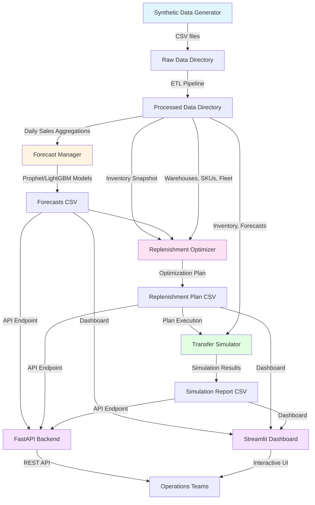

# Multi-Warehouse Predictive Replenishment with Transport Constraints

A production-ready system for multi-warehouse inventory management that combines demand forecasting, cost-optimal replenishment planning, and simulation capabilities.

## Features

- **Demand Forecasting**: Prophet and LightGBM models for SKU×warehouse level predictions
- **Optimization Engine**: OR-Tools/PuLP-based replenishment planner respecting transport constraints
- **Transfer Simulation**: Stochastic simulation with lead-time and demand variability
- **API & Dashboard**: FastAPI backend and Streamlit dashboard for operations teams
- **Synthetic Data**: Deterministic data generator for testing and demos

  # System Architecture

## Data Flow Diagram



## Component Overview

### 1. Data Generation (`src/data/`)
- **synthetic_generator.py**: Generates realistic multi-warehouse datasets
  - Warehouses with locations, capacities, lead times
  - SKUs with volumes, weights, perishability
  - Historical sales with seasonality and promotions
  - Fleet metadata (trucks, drivers)
  - Inbound purchase orders

### 2. ETL Pipeline (`src/etl/`)
- **etl.py**: Processes raw data
  - Validates referential integrity
  - Creates daily sales aggregations
  - Generates rolling features (7d, 28d means, lags)
  - Adds seasonality and promotion indicators

### 3. Forecasting (`src/forecast/`)
- **forecast_manager.py**: Demand prediction
  - Prophet model for time-series forecasting
  - LightGBM model for ML-based predictions
  - Generates forecasts with prediction intervals
  - Supports 7, 14, 28-day horizons

### 4. Optimization (`src/optimization/`)
- **replenishment_optimizer.py**: Cost-optimal planning
  - PuLP/OR-Tools solver for optimization
  - Greedy heuristic fallback
  - Respects constraints:
    - Truck capacity (volume, weight)
    - Driver availability
    - Dock time windows
    - Perishability TTL
    - Warehouse capacity
  - Minimizes: transport + holding + stockout + waste costs

### 5. Simulation (`src/simulator/`)
- **transfer_simulator.py**: Stochastic execution
  - Simulates lead-time variability
  - Models demand uncertainty
  - Calculates realized costs
  - Tracks service levels and waste

### 6. API (`src/api/`)
- **app.py**: FastAPI backend
  - `/forecast`: Get demand forecasts
  - `/optimize`: Run optimization
  - `/plan/{plan_id}`: Retrieve plan details
  - `/metrics`: Key KPIs
  - `/simulate/{plan_id}`: Run simulation

### 7. Dashboard (`src/dashboard/`)
- **app.py**: Streamlit interface
  - Warehouse KPIs and inventory levels
  - Interactive forecast explorer
  - Plan viewer with Gantt charts
  - Simulation results visualization

### 8. Utilities (`src/utils/`)
- **cost_model.py**: Cost calculations
  - Transport costs (distance, truck type)
  - Holding costs
  - Stockout penalties
  - Perishability waste costs
- **explanations.py**: Decision explanations
  - Human-readable transfer rationales
  - Cost delta calculations
  - Top decision drivers

## Data Storage

- **Raw Data** (`data/raw/`): CSV files from generator
- **Processed Data** (`data/processed/`): ETL outputs
- **Forecasts** (`data/forecasts/`): Model predictions
- **Plans** (`output/reports/`): Optimization results
- **Simulations** (`output/reports/`): Simulation reports

## Optional Infrastructure

- **PostgreSQL**: For production data storage (via docker-compose)
- **Redis**: For caching (via docker-compose)

## Execution Flow

1. **Data Generation**: `make data` → generates synthetic CSVs
2. **ETL**: `make etl` → processes and aggregates data
3. **Forecasting**: `make forecast` → trains models and generates predictions
4. **Optimization**: `make optimize` → creates replenishment plan
5. **Simulation**: `make simulate` → evaluates plan robustness
6. **API/Dashboard**: `make run` / `make dashboard` → exposes interfaces

## Quick Start

```bash
# Install dependencies
make install

# Generate sample data
make data

# Run ETL pipeline
make etl

# Train forecasts
make forecast

# Generate replenishment plan
make optimize

# Run API server
make run

# Run tests
make test
```

## Project Structure

```
├── src/              # Core application code
├── notebooks/        # Demo notebooks
├── tests/            # Unit tests
├── data/             # Data directories (raw, processed)
├── ci/               # CI scripts
├── architecture/     # Architecture documentation
└── output/           # User-facing artifacts
```

## Requirements

- Python 3.9+
- Docker & Docker Compose (optional, for Postgres/Redis)

## Documentation

See `/output/README.md` for comprehensive user documentation and quickstart guide.

